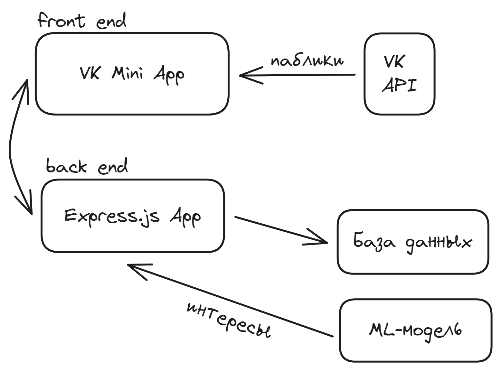
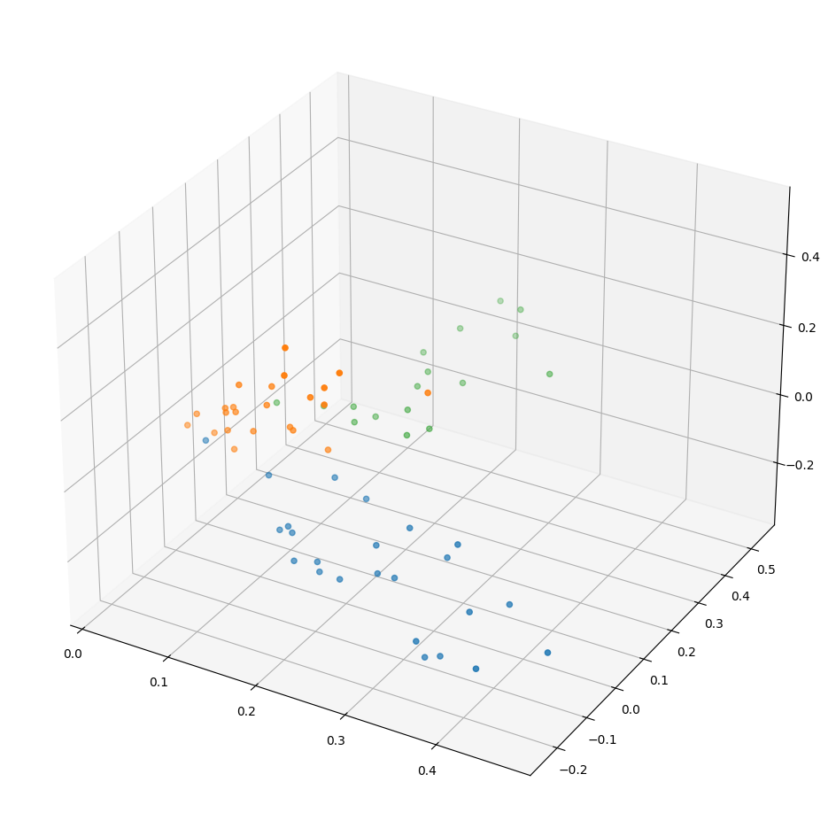

# Smoke

[1]: https://sochisirius.ru/
[2]: https://bigchallenges.ru/

VK Mini App со встроенной ML-моделью, которая по интересам подростка, основываясь на его подписках во “ВКонтакте”,  будет предлагать товары-альтернативы, которые пользователь сможет приобрести на сэкономленные с отказа от курения деньги.

## Структура приложения

Наше приложение состоит из трех условных частей: front end, back end и ML-модель (рис. 1). С front-end частью взаимодействует пользователь, а его данные в свою очередь front end “подтягивает” из бэкенда (и от VK API). Бэкенд на сервере взаимодействует с базой данных и ML-моделью.

*Рисунок 1: схема приложения.*

## Модель машинного обучения

От нашей модели требуется, чтобы она по каким-то интересам пользователя могла определить товары, которые его могут заинтересовать. Так как наше приложение размещено на платформе VK Mini Apps, мы можем использовать VK API для получения данных о группах и сообществах, на которые подписаны пользователи.

Мы собирали датасет в две попытки.

Первая попытка заключалась в создании Mini App-опроса, в котором пользователю требовалось выбрать, чем из перечисленного он заинтересован. С помощью VK API после опроса мы собирали списки подписок пользователей. К сожалению, только при анализе полученных данных мы осознали, что данные, получаемые таким образом, оказались неразмеченными: пользователь может интересоваться несколькими из предложенных групп интересов и быть подписанным на паблики по всем из них. Таким образом, связи между выбранными вариантами в опросе и подписками установить не представлялось возможным.

После этого мы решили вручную разметить 320 сообществ на 8 категорий: еда, косметика, одежда, мероприятия, техника, видеоигры, мерч и “мусор”. В мусор мы размечали все, что не относилось к остальным категориям.

Для предобработки полученных текстовых данных о пабликах (название, описание, вид активности и статус) мы использовали довольно стандартный набор методик:

* приведение к нижнему регистру
* токенизация (word-tokenizer)
* удаление стоп-слов
* лемматизация
* TF-IDF векторизация
* Truncated SVD (для сокращения размерности)

После визуализации мы обнаружили, что лучше всего заметны кластеры трех категорий: еда, косметика и видеоигры (рис. 2)

*Рисунок 2: косметика - синий, видеоигры - оранжевый, еда - зеленый.*

В качестве модели классификации была выбрана KNN ввиду своей эффективности в предсказании категорий для данных нашего вида. Accuracy обученной модели составила 65.9%. Точность невелика и на данный момент недостаточна для рекомендации товаров в прототипе нашего продукта.  Это объясняется небольшим размером итогового датасета (90 записей) и несовершенством предобработки и самой модели. В процессе работы над MVP мы продолжаем пополнять наш датасет и стараемся подбирать более точные позиции с хорошим набором ключевых слов для более качественного обучения модели машинного обучения. К сожалению, данный процесс занимает огромное количество времени, так как автоматизировать на текущем этапе проекта не представляется возможным.

## Back end

Back-end часть нашего приложение должна обрабатывать запросы на сохранение данных пользователей, их получение и предсказание интересов пользователя с помощью ML-модели.

В качестве back-end фреймворка был выбран Express.js ввиду простоты использования и широкого спектра сторонних библиотек. База данных - PostgreSQL, современный и отказоустойчивый аналог MySQL. Взаимодействие с JS осуществляется посредством ORM и клиента Prisma. ML-модель расположена на том же сервера, что и весь остальной софт и используется посредством child-process-библиотеки.

## Front end

Так как наше приложение размещено на платформе VK Mini Apps, front-end стек определен следующими технологиями: React, VKUI и VK Bridge.

React позволяет писать легко расширяемые и поддерживаемые приложения, и имеет множество open-source библиотек, упрощающих разработку. VKUI предоставляет компоненты, адаптирующиеся под разные платформы (Android, iOS, веб-клиент) и соответствующие дизайн-коду VK.

VK Bridge нужен для взаимодействия с VK API. В нашем случае из него мы запрашиваем токены для авторизации и аутентификации пользователей и данные об их подписках.

---
[][1]
[][2]

---
